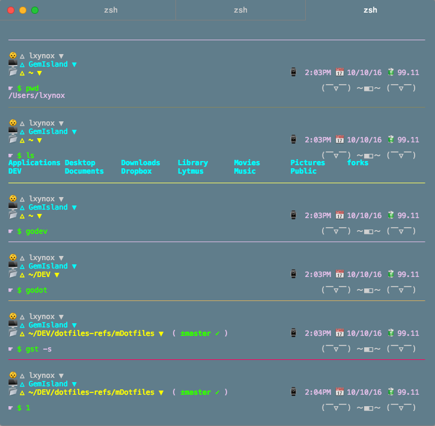
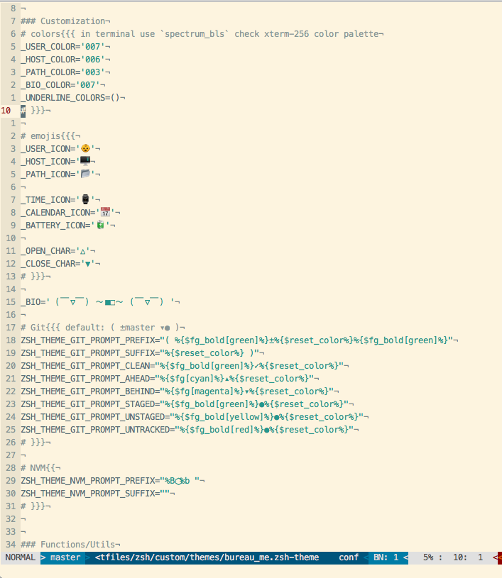

# Emojeer



### Requirement
This theme is intended to be used with [oh-my-zsh](https://github.com/robbyrussell/oh-my-zsh) (which depends on **ZSH**).

### Feature

* customizable emoji icons
* customizable bio description
* customizable border line color(random 256 color by default)

### Installation

1. Download the theme

    ```bash
    curl https://raw.githubusercontent.com/lxynox/emojeer/master/emojeer.zsh-theme > ~/.oh-my-zsh/custom/themes/emojeer.zsh-theme
    ```

2. Update `~/.zshrc`($ZSHRC)

    `ZSH_THEME="emojeer"`

3. Source $ZSHRC/Open new tabs to view changes

### Display

| name | variable(src) |
| --- | --- |
| user | $_USER |
| host | $_USER |
| path | $_1LEFT |
| time | $_1RIGHT |
| date | $_1RIGHT |
| battery | $_1RIGHT |
| BIO | $_BIO |
| command prompt | $PROMPT |

### Customization

All the emoji icons can be easily twitsted, directly edit the source file ☛: `vi $ZSH/custom/themes/emojier.zsh-themes` and goto the **Customization** section.


### Credit

I forked [bureau](https://github.com/robbyrussell/oh-my-zsh/blob/master/themes/bureau.zsh-theme) as my personal *oh-my-zsh* theme and tweaked it appeal to personal flavour.
